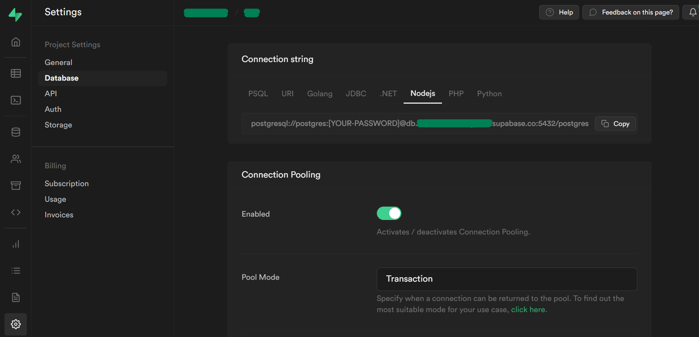
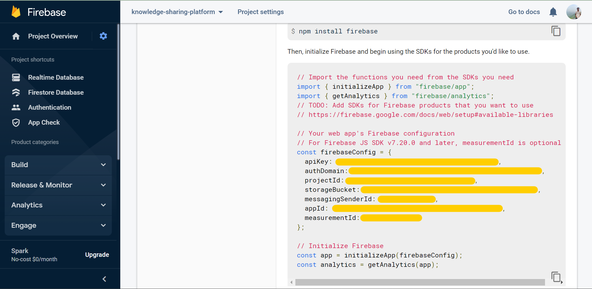
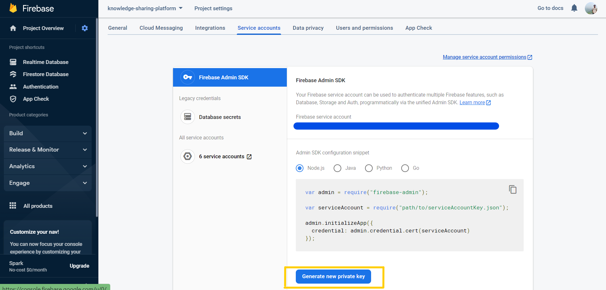

# Knowledge Sharing Platform 🗒

Knowledge sharing platform application aims to get the students acquainted with the courses, professors, evaluation schemes. The said things can be achieved via gathering course feedback, professor feedback, and previous year grading schemes. This can be done by making a portal (just like a blog site) where people can share their honest reviews without being scrutinized much. Getting reviews from mass makes it easy for one to choose the particular course and get the right information about that course. Crowd-sourcing of materials and feedback would make it easy to organize resources at one place. It would be more reliable, save one’s time and avoid unnecessary bothering. Moreover, students can also get relevant course resources from the students who already opted for the course. This platform can also act as a general guidance portal.

## Techstack 👩‍💻

NextJS, TailwindCSS

## Maintainers ☀️

| [@Ananya](https://github.com/Ananyaiitbhilai) | [@Anshuman Dhiman](https://github.com/AnshumanDhiman) |
| --------------------------------------------- | ----------------------------------------------------- |

## Other details 📑

This project is in its secomd iteration. We might have NodeJS as backend. In future, might do clustering of students on the basis of the course taken.

## Contribution Guidelines ✨

Please go through the Wiki. The success of our vision to bring knowledge to every single hand depends on you. Even a small contribution helps. All forms of contributions are highly welcomed and valued.

-   [How to create a PR?](https://github.com/OpenLake/Knowledge-Sharing-Platform/wiki/How-to-create-a-PR%3F)
-   [PR Format Guidelines](https://github.com/OpenLake/Knowledge-Sharing-Platform/wiki/PR-Format-Guidelines)

## Set-up the project 💻

### Environment Variables

Make a `.env` with the same fields in `.env.example`.

-   For database, you can use the postgres database of Supabase. And the **connection string** can be found in the project settings of database, as shown in the picture below:
    

 

-   `NEXT_PUBLIC_API_KEY, NEXT_PUBLIC_AUTH_DOMAIN NEXT_PUBLIC_PROJECT_ID, NEXT_PUBLIC_STORAGE_BUCKET NEXT_PUBLIC_MESSAGING_SENDER_ID, NEXT_PUBLIC_APP_ID NEXT_PUBLIC_MEASUREMENT_ID`
    These variables can be found in the Firebase Project Settings, after creating a web app in Firebase.
    

 

-   `TYPE, PROJECT_ID, PRIVATE_KEY_ID, PRIVATE_KEY='{"privateKey":""}', CLIENT_EMAIL, AUTH_URI, TOKEN_URI`
    These variables can be found in `Service Accounts` section of Project Settings of the app by clicking on **Generate new private key**.
    

### Install the dependencies

`npm i`

### Run the server

`npm run dev`
